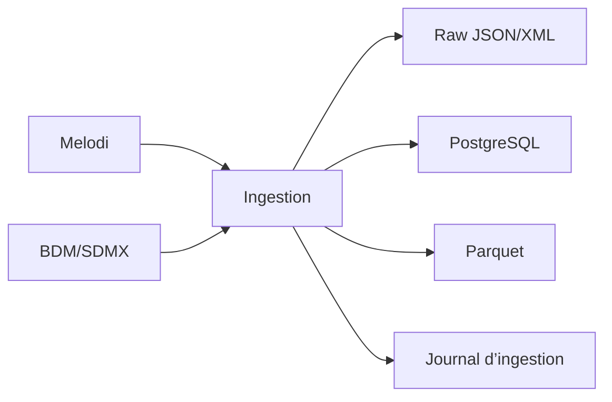
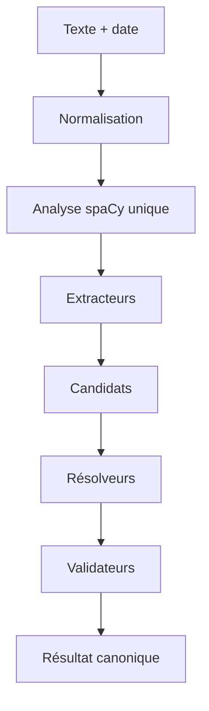

# StatCheck France

## Documentation fonctionnelle, technique, architecturale et expérimentale

**Statut du document :** documentation consolidée du projet  
**Périmètre couvert :** cadrage initial, socle de données, ingestion, parsing NLP, LLM contraint, évaluation et sélection de l’architecture V1  
**Date de consolidation :** 30 juillet 2026  

---

# 1. Résumé exécutif et Vision Produit

StatCheck France est un système de fact-checking automatisé de nouvelle génération. Son objectif n'est pas d'utiliser l'Intelligence Artificielle comme un oracle de vérité, mais comme un **traducteur d'intentions**. Le système vise à reconstruire un chemin de preuve totalement reproductible et mathématiquement exact, depuis la phrase de l'utilisateur jusqu'à la base de données officielle de l'INSEE.

**L'approche Neuro-Symbolique :**
L'innovation majeure de StatCheck réside dans son architecture neuro-symbolique. Nous combinons :
- **Le Neuro (LLM)** : Utilisé exclusivement pour ses capacités de compréhension sémantique (désambiguïser des concepts flous comme "les jeunes", comprendre qu'une phrase compare deux dates).
- **Le Symbolique (Moteur Déterministe)** : Utilisé pour extraire les nombres de manière infaillible, croiser des territoires avec le Code Officiel Géographique (COG), et calculer les variations mathématiques.

**Le Juge de Paix (Safety-First) :**
Le système préférera systématiquement s'abstenir (répondre *INSUFFICIENT_CONTEXT*) plutôt que de valider un chiffre trompeur. Si une IA générative modifie "15 points" en "15 %", StatCheck le détecte comme une **Erreur Critique Silencieuse** et rejette le traitement. L'évaluation scientifique du système est entièrement construite autour de l'évitement de ces erreurs critiques.

---

# 2. Problème Traité : La Complexité de la Statistique Publique

Vérifier une affirmation statistique est un défi d'ingénierie car le langage naturel est intrinsèquement ambigu, tandis que la donnée officielle (SDMX) est structurée de manière ultra-rigide.

Prenons l'affirmation : *"Le chômage des jeunes a baissé de 2 % au dernier trimestre."*
Pour un humain ou un LLM basique, cela semble simple. Pour un système informatique requêtant l'INSEE, cette phrase manque cruellement de dimensions techniques :
- **Indicateur :** Parle-t-on du taux de chômage au sens du BIT ou du nombre de demandeurs d'emploi inscrits à France Travail ?
- **Population :** "Jeunes" signifie-t-il les 15-24 ans ou les moins de 25 ans ?
- **Territoire :** Est-ce la France entière (incluant Mayotte) ou la France métropolitaine ? (Souvent implicite).
- **Opération Mathématique :** S'agit-il d'une baisse relative (le chiffre a diminué de 2%) ou d'une baisse absolue (le taux a perdu 2 points de pourcentage) ?
- **Temporalité :** Baisse par rapport au trimestre précédent (évolution trimestrielle) ou par rapport au même trimestre l'année dernière (glissement annuel) ?

Le rôle de l'architecture NLP de StatCheck est de cartographier ces ambiguïtés, d'extraire les paramètres probables sous un format canonique, et de les résoudre face au catalogue officiel.

---

# 3. Principes d'Architecture et Ingénierie Logicielle

Le système a été pensé selon des principes d'ingénierie logicielle de haut niveau pour garantir sa scalabilité, sa résilience et son auditabilité.

## 3.1 Déterminisme et Traçabilité (Provenance des données)
Chaque variable extraite d'une phrase possède une **provenance** stricte. Le système sait à chaque instant si un filtre a été extrait par une expression régulière (infaillible), par croisement avec un lexique officiel, ou par déduction probabiliste du LLM. 
Lors du processus de fusion, une **Matrice d'Autorité** tranche les conflits algorithmiquement : le LLM n'a jamais l'autorisation d'écraser un chiffre, une date ou un code géographique trouvé par le moteur symbolique.

## 3.2 Modélisation Hybride des Données (PostgreSQL + Parquet)
La gestion des données massives de l'INSEE est séparée pour optimiser la mémoire et la vitesse de recherche :
- **PostgreSQL (Métadonnées et Catalogue) :** Stocke le catalogue des jeux de données, les dimensions et les modalités. Le schéma relationnel utilise exclusivement des identifiants universels **UUID v4**. Cela permet la scalabilité horizontale et garantit qu'aucune collision de clés primaires ne surviendra si le projet intègre un jour les données d'Eurostat ou de l'OCDE.
- **Apache Parquet (Séries Chronologiques) :** Les millions de lignes d'observations mathématiques ne sont pas insérées dans la base SQL pour éviter la congestion. Elles sont stockées dans des fichiers orientés colonnes, ultra-compressés, et partitionnés par année.

## 3.3 Idempotence et Résilience du Pipeline ETL
Le pipeline d'ingestion qui aspire l'API de l'INSEE est conçu pour ne jamais échouer silencieusement et ne jamais faire de travail inutile :
- **Méthode des Hashs (SHA-256) :** À chaque requête API, un hash cryptographique du flux XML est calculé. Le système compare ce hash à la base de données. Si la donnée n'a pas changé côté INSEE, le script passe au fichier suivant en quelques millisecondes (Idempotence parfaite).
- **Streaming XML (iterparse) :** Pour éviter les crashs de saturation de RAM (`MemoryError`) lors de la lecture des fichiers XML de plusieurs gigaoctets de l'INSEE, le pipeline utilise la lecture en flux (streaming). Chaque balise XML est traitée puis instantanément supprimée de la mémoire vive.

---

# 4. Architecture Globale du Système

Le cycle de vie d'une requête traverse quatre grandes phases, modélisées sous forme d'un pipeline unidirectionnel (Pipeline Pattern).

```mermaid
flowchart TD
    %% Entrée
    User[Utilisateur] -->|Soumet une affirmation| NLP
    
    %% Phase 3 : NLP & Extraction Canonique
    subgraph Phase 3 : Intelligence Linguistique
        NLP[Routeur de Modèles]
        NLP -->|Cas simples| B_Base[Baseline Symbolique]
        NLP -->|Cas complexes| B_LLM[LLM Contraint]
        B_Base --> Fusion[Moteur de Fusion Algorithmique]
        B_LLM -->|Post-validation| Fusion
        Fusion --> Canon[{Format Canonique Pivot}]
    end
    
    %% Phase 4 : Retrieval & Résolution
    subgraph Phase 4 : Moteur de Recherche RAG
        Canon --> R_Lex[Recherche BM25]
        Canon --> R_Vec[Recherche Sémantique pgvector]
        R_Lex --> RRF[Reciprocal Rank Fusion]
        R_Vec --> RRF
        RRF --> Resolve[Résolveur de Dimensions SDMX]
    end
    
    %% Phase 2 : Socle Data
    subgraph Phase 2 : Infrastructure INSEE
        Resolve --> DB_Meta[(PostgreSQL : Catalogue SDMX)]
        Resolve --> DB_Obs[(Parquet : Séries Mathématiques)]
    end
    
    %% Phase 1 : Calcul
    subgraph Phase 1 : Moteur Mathématique
        DB_Meta --> Calc[Calculateur Déterministe]
        DB_Obs --> Calc
        Calc --> Verdict[Générateur de Rapport d'Audit]
    end
    
    Verdict -->|Verdict explicable + Preuves| User
    
    classDef input fill:#f9f,stroke:#333,stroke-width:2px;
    classDef output fill:#bbf,stroke:#333,stroke-width:2px;
    classDef core fill:#e1f5fe,stroke:#0277bd,stroke-width:2px;
    
    class User input;
    class Verdict output;
    class Fusion,RRF,Resolve,Calc core;
```

## 4.1 Explication du Flux de Bout en Bout
1. **L'Extraction (Phase 3) :** L'affirmation entre dans le système. Un routeur décide dynamiquement de la difficulté. Les extractions du LLM et de la Baseline sont fusionnées par un algorithme de graphe biparti pour produire un objet de données standardisé : le **Format Canonique**.
2. **La Recherche (Phase 4) :** À partir des concepts extraits, le système interroge le catalogue local. Il utilise l'algorithme RRF pour combiner la recherche par mots-clés exacts (BM25) et la recherche par similarité sémantique (Vecteurs) afin de trouver le bon "Dataflow" INSEE, puis résout les filtres.
3. **L'Infrastructure (Phase 2) :** Tournant de manière asynchrone, cette infrastructure maintient notre miroir local de l'INSEE toujours à jour, protégeant l'application des pannes externes.
4. **Le Calcul (Phase 1) :** Les données temporelles sont chargées en mémoire via `pandas`. Le moteur de calcul applique les formules métier (évolution en points, glissement annuel) et génère le rapport final.

# 6. Phase 1 — Cadrage et fondations

## 6.1 Lot 0 — Vision

Le problème défini est le suivant :

> Permettre à un utilisateur de soumettre une affirmation statistique et d’obtenir une analyse fondée sur des données officielles, avec un chemin de preuve explicable.

Utilisateurs possibles :

- journalistes ;
- étudiants ;
- chercheurs ;
- analystes ;
- citoyens ;
- équipes de fact-checking ;
- auteurs de contenus.

## 6.2 Corpus initial de 30 affirmations

Le Lot 0 prévoit un premier ensemble d’affirmations réelles provenant :

- de la presse ;
- de discours ;
- de réseaux sociaux ;
- de fact-checks existants.

Le corpus doit couvrir :

- inflation ;
- chômage ;
- démographie ;
- entreprises ;
- retraites ;
- santé ;
- justice ;
- sécurité.

Une priorité a été retenue pour le PoC :

> disposer d’une majorité d’affirmations directement compatibles avec les données INSEE afin que le premier connecteur puisse réellement les traiter.

## 6.3 Difficultés recherchées

Le corpus doit inclure :

- stock contre flux ;
- dénominateur ambigu ;
- pourcentage contre points ;
- comparaison temporelle ;
- territoire implicite ;
- population mal définie ;
- source introuvable ;
- données inexistantes ;
- série provisoire ;
- formulation trompeuse.

## 6.4 Taxonomie des verdicts

Taxonomie de travail :

```text
SUPPORTED
APPROXIMATELY_SUPPORTED
CONTRADICTED
MISLEADING
INSUFFICIENT_CONTEXT
SOURCE_NOT_FOUND
DATA_NOT_AVAILABLE
```

Cette taxonomie doit rester distincte des statuts techniques du parsing.

Exemple :

```text
parse_status = AMBIGUOUS
```

n’est pas un verdict factuel.

---

# 7. Sources statistiques

## 7.1 INSEE Melodi

Melodi fournit un accès au catalogue moderne des données statistiques de l’INSEE.

Rôle dans StatCheck :

- découverte des datasets ;
- titres ;
- descriptions ;
- thèmes ;
- couverture ;
- métadonnées ;
- recherche fonctionnelle.

Lien : [API Melodi](https://api.insee.fr/melodi)

## 7.2 BDM/SDMX

La BDM fournit des séries chronologiques structurées selon SDMX.

Ressources importantes :

```text
dataflow
datastructure
conceptscheme
codelist
data
```

Concepts :

- dataflow : groupe de séries ;
- DSD : structure et ordre des dimensions ;
- codelist : modalités autorisées ;
- series key : combinaison de dimensions ;
- observation : valeur associée à une période.

## 7.3 API Métadonnées

Elle apporte :

- concepts ;
- nomenclatures ;
- indicateurs ;
- opérations statistiques ;
- historique du COG.

## 7.4 Code officiel géographique

Le COG est la référence pour :

- communes ;
- arrondissements municipaux ;
- communes associées ;
- communes déléguées ;
- départements ;
- régions ;
- collectivités ;
- pays ;
- relations hiérarchiques ;
- historique.

Une photographie obtenue depuis `geo.api.gouv.fr` ne doit pas être étiquetée arbitrairement `COG 2024`. Un vrai fichier millésimé doit venir de l’archive INSEE correspondante.

---

# 8. Phase 2 — Socle Data et ingestion

## 8.1 Objectif

Construire un catalogue local permettant de rechercher :

- les datasets ;
- leurs dimensions ;
- leurs modalités ;
- leurs séries ;
- leurs versions ;
- leur provenance.

## 8.2 Architecture de stockage hybride



| Support | Contenu |
|---|---|
| PostgreSQL | Métadonnées normalisées |
| JSON/XML | Réponses originales |
| Parquet | Observations |
| Manifestes | URL, date, hash et versions |

## 8.3 Modèle relationnel

### Fournisseurs

```text
sources
source_endpoints
```

### Catalogue

```text
datasets
dataset_aliases
dataset_relations
```

### Structures

```text
dimensions
dataset_dimensions
modalities
dataset_dimension_modalities
```

### Séries

```text
series
series_dimension_values
```

### Ingestion

```text
ingestion_runs
ingestion_items
resource_versions
ingestion_errors
```

## 8.4 Identifiants

Une clé externe ne doit pas être supposée globalement unique.

Clé recommandée :

```text
source
+ type de ressource
+ identifiant externe
```

## 8.5 Versionnement

Trois niveaux de hash ont été définis.

### Hash brut

Calculé sur les octets reçus.

### Hash normalisé

Calculé après normalisation stable.

### Hash métier

Calculé sur :

- description ;
- structure ;
- modalités ;
- observations.

Cela permet de distinguer un changement technique d’un véritable changement statistique.

## 8.6 Événements de changement

```text
DATASET_CREATED
DATASET_REMOVED
TITLE_CHANGED
DIMENSION_ADDED
DIMENSION_REMOVED
DIMENSION_ORDER_CHANGED
MODALITY_ADDED
MODALITY_REMOVED
MODALITY_LABEL_CHANGED
OBSERVATION_ADDED
OBSERVATION_REVISED
OBSERVATION_STATUS_CHANGED
```

## 8.7 Arborescence

```text
data/
├── raw/
│   ├── insee-melodi/
│   └── insee-bdm/
├── normalized/
│   ├── metadata/
│   └── observations/
├── manifests/
├── quarantine/
└── temporary/
```

## 8.8 Pipeline d’ingestion

```text
catalogue
→ fiche dataset
→ structure
→ dimensions
→ codelists
→ modalités
→ contrôles
→ publication atomique
```

## 8.9 Reprise sur erreur

Le pipeline doit :

- journaliser chaque objet ;
- isoler les erreurs ;
- reprendre au dernier point sûr ;
- éviter les doublons ;
- conserver la dernière version valide ;
- mettre les réponses invalides en quarantaine.

## 8.10 Idempotence

Deux exécutions sur la même source inchangée doivent produire :

- aucune duplication ;
- aucune version inutile ;
- le même état actif ;
- deux journaux d’exécution distincts.

---

# 9. Phase 3 — Intelligence linguistique

## 9.1 Objectif

Transformer une phrase en objet structuré :

```text
indicateur
population
territoire
temps
mesure
unité
opération
comparateur
fréquence
ajustement
ambiguïtés
```

La Phase 3 ne produit pas encore de verdict.

---

# 10. Lot 4 — Corpus Gold

## 10.1 Taille

```text
200 affirmations
```

## 10.2 Splits

```text
Train/développement : 120
Validation          : 40
Test final          : 40
```

## 10.3 Prévention des fuites

Doivent rester ensemble :

- paraphrases ;
- affirmations issues du même événement ;
- formulations reposant sur la même statistique.

## 10.4 Annotations

```text
claims
claim_annotations
claim_spans
claim_semantics
claim_dataset_judgments
claim_dimension_judgments
claim_query_gold
```

## 10.5 Difficultés couvertes

- négation ;
- approximation ;
- superlatif ;
- date relative ;
- comparaison elliptique ;
- ratio ;
- cumul ;
- record ;
- données non répondables ;
- source absente.

---

# 11. Lot 6A — Baseline hybride classique

## 11.1 Positionnement

La baseline n’est pas un simple ensemble de RegEx. Elle combine :

- règles ;
- spaCy ;
- NER ;
- lemmatisation ;
- dépendances ;
- `dateparser` ;
- COG ;
- lexiques ;
- validateurs.

Elle est non générative et explicable.

## 11.2 Pipeline



## 11.3 Normalisation

```text
raw_text
display_normalized_text
matching_normalized_text
```

Les offsets doivent pouvoir revenir au texte brut.

## 11.4 Extracteurs

```text
measure
time
territory
indicator
population
comparison
frequency
adjustment
negation
```

## 11.5 Résolveurs

```text
measure_roles
temporal_relations
geographic_candidates
operation_direction
```

## 11.6 Mesures

Rôles :

```text
CURRENT_VALUE
START_VALUE
END_VALUE
THRESHOLD
CLAIMED_CHANGE
ABSOLUTE_CHANGE
RELATIVE_CHANGE
RATIO_VALUE
RANK_VALUE
```

## 11.7 Temps

La date de publication est obligatoire pour résoudre une date relative.

```text
« le mois dernier »
→ intervalle mensuel
```

et non un jour arbitraire.

## 11.8 Territoire

```text
NER
→ COG
→ type
→ code
→ millésime
→ alternatives
```

Absence de territoire :

```text
MISSING
```

et non `France`.

## 11.9 Direction et polarité

```text
direction = DECREASE
polarity = NEGATED
```

pour « ne baisse pas ».

## 11.10 Validation

- spans ;
- structure ;
- valeurs ;
- unités ;
- temps ;
- géographie ;
- contradictions.

---

# 12. Lot 6B — LLM contraint

## 12.1 Rôle

Le LLM traite principalement :

- indicateurs complexes ;
- populations ;
- relations ;
- comparaisons ;
- opérations ;
- ambiguïtés.

## 12.2 Interdictions

Il ne doit pas :

- choisir un dataset ;
- inventer un code ;
- inventer une modalité ;
- produire un verdict ;
- compléter silencieusement.

## 12.3 Structured Outputs

Le schéma impose :

```text
schema_version
parse_status
indicators
populations
territories
time_expressions
measures
operation
frequency
adjustment
comparisons
ambiguities
missing_context
```

## 12.4 Spans

Le LLM retourne :

```text
source_text
occurrence
source_scope
```

Les offsets définitifs sont recalculés par Python.

## 12.5 Post-validation

```text
provenance
→ nombres
→ temps
→ géographie
→ cohérence
→ inférences interdites
→ déduplication
```

## 12.6 Sorties

```text
LLM_RAW
LLM_VALIDATED
```

## 12.7 Erreurs

```text
COMPLETED
REFUSED
INCOMPLETE
API_ERROR
PARSE_ERROR
POST_VALIDATION_FAILED
```

---

# 13. Format canonique

Le format commun permet de comparer :

```text
Gold
Baseline
LLM
Fusion
```

Base commune :

```text
source_text
start
end
source_scope
origin
method
validation_status
```

Types spécialisés recommandés :

```text
CanonicalMeasure
CanonicalTimeExpression
CanonicalTerritory
CanonicalIndicator
CanonicalPopulation
```

---

# 14. Lot 6C — Évaluation

## 14.1 Infrastructure annoncée

```text
src/parser/canonical.py
src/models/evaluation.py
src/evaluation/taxonomies.py
src/evaluation/metrics.py
src/evaluation/scorer.py
src/evaluation/run_baseline_eval.py
src/evaluation/run_llm_eval.py
```

## 14.2 Stockage

```text
EvaluationRun
EvaluationPrediction
EvaluationFieldScore
FusionDecision
EvaluationMetric
```

## 14.3 Métriques

- F1 span exact ;
- F1 relâché ;
- F1 normalisé ;
- F1 sémantique ;
- micro F1 ;
- macro F1 ;
- exact match complet ;
- couverture ;
- abstention ;
- erreurs critiques ;
- erreurs critiques silencieuses ;
- latence ;
- coût.

## 14.4 Scorer

Le scorer doit :

- effectuer un appariement non positionnel ;
- gérer les mentions répétées ;
- comparer les offsets ;
- utiliser des comparateurs typés ;
- distinguer erreur numérique, temporelle, géographique et sémantique ;
- bootstrapper par groupe ;
- utiliser McNemar exact sur petits effectifs.

## 14.5 Situation documentée

Les scripts d’évaluation ont été décrits avec :

- données mockées pour la baseline ;
- simulateur pour le LLM ;
- infrastructure JSONL ;
- trois tentatives prévues.

Conclusion exacte :

> L’infrastructure d’évaluation est préparée, mais les métriques officielles nécessitent encore le branchement sur le vrai Gold, la vraie baseline et le vrai fournisseur LLM.

---

# 15. Fusion déterministe

## 15.1 Étapes

```text
regrouper par champ
→ générer les paires
→ scorer les alignements
→ apparier
→ appliquer la matrice
→ revalider
```

## 15.2 Relations

```text
EXACT
OVERLAP
CONTAINS
NORMALIZED_TEXT_MATCH
NORMALIZED_VALUE_MATCH
DECOMPOSITION
CONFLICTING
UNRELATED
```

## 15.3 Autorités

| Champ | Autorité |
|---|---|
| Nombre | Validateur déterministe |
| Unité | Baseline |
| Date | Validateur temporel |
| Code géographique | COG |
| Indicateur | LLM validé |
| Population | LLM validé |
| Opération | LLM + règles |
| Négation | Baseline syntaxique |
| Fréquence | Baseline |
| Ajustement | Baseline |

## 15.4 Décisions

```text
AGREEMENT
BASELINE_SELECTED
LLM_SELECTED
DETERMINISTIC_VALIDATOR_SELECTED
MERGED
BOTH_RETAINED_AS_ALTERNATIVES
CONFLICT_UNRESOLVED
REJECTED
```

Chaque décision doit avoir une provenance.

---

# 16. Quatre architectures candidates

## C0 — Baseline

```text
phrase → baseline → validation
```

## C1 — LLM

```text
phrase → LLM → post-validation
```

La validation n’ajoute pas des champs trouvés uniquement par la baseline.

## C2 — Fusion systématique

```text
phrase → baseline et LLM en parallèle → fusion
```

Appel LLM : 100 %.

## C3 — Cascade

```text
phrase → baseline → routeur
cas simple → baseline
cas complexe → LLM + fusion
```

Déclencheurs :

- champ manquant ;
- ambiguïté ;
- contradiction ;
- opération complexe ;
- négation ;
- ratio ;
- superlatif ;
- rôles non résolus.

---

# 17. Choix V1

## 17.1 Élimination

Éliminer une architecture si elle :

- accepte un nombre inventé ;
- accepte un code inventé ;
- ne sait pas s’abstenir ;
- perd la provenance ;
- dépasse le budget ;
- dépasse la latence ;
- produit trop d’erreurs critiques.

## 17.2 Classement

Ordre :

1. erreurs critiques silencieuses ;
2. exact match ;
3. F1 métier ;
4. couverture ;
5. stabilité ;
6. latence ;
7. coût ;
8. complexité.

## 17.3 Revue humaine

- validation uniquement ;
- cas discordants ;
- revue aveugle ;
- ordre randomisé ;
- grille précise.

## 17.4 Candidat probable

C3 est une hypothèse prometteuse, pas encore un résultat :

```text
qualité proche de C2
+ coût inférieur
+ repli sur C0
```

---

# 18. Test final

## 18.1 Périmètre

```text
40 affirmations
```

jamais utilisées pour le développement.

## 18.2 Pré-enregistrement

Geler :

- commit ;
- corpus ;
- architecture ;
- modèle ;
- prompt ;
- schéma ;
- COG ;
- validateurs ;
- fusion ;
- routeur ;
- seuils ;
- retries ;
- métriques.

## 18.3 Une seule campagne

Interdictions :

- corriger manuellement ;
- choisir la meilleure tentative ;
- modifier les seuils ;
- relancer parce que le résultat déplaît.

Retries uniquement sur erreurs techniques.

## 18.4 Publication

Publier :

- scores ;
- numérateurs ;
- dénominateurs ;
- intervalles ;
- erreurs ;
- coûts ;
- latences ;
- limites.

Avec 40 cas :

```text
1 cas = 2,5 points
```

---

# 19. Retrieval et résolution des dimensions

Cette partie est définie dans la Phase 3 initiale mais intervient après le parsing.

## 19.1 Index lexical

Champs :

- titre ;
- alias ;
- indicateur ;
- description ;
- dimensions ;
- modalités ;
- thème.

## 19.2 Embeddings

Chaque embedding conserve :

- modèle ;
- version ;
- dimensions ;
- texte ;
- hash ;
- date.

## 19.3 Fusion

Baseline recommandée :

```text
BM25/FTS
+ vectoriel
→ Reciprocal Rank Fusion
→ reranking
```

## 19.4 Résolution

Exemple :

```text
« jeunes »
→ candidats :
  - 15-24 ans
  - 15-29 ans
  - moins de 25 ans
```

Le choix dépend du dataset.

## 19.5 Contraintes

### Dures

- modalité inexistante ;
- période hors couverture ;
- série inexistante ;
- territoire absent ;
- unité incompatible.

### Souples

- préférence lexicale ;
- fréquence probable ;
- population probable ;
- territoire principal.

---

# 20. Expériences pour publication

## 20.1 Baseline contre LLM

Comparer :

- F1 ;
- exact match ;
- hallucinations ;
- coût ;
- latence.

## 20.2 Post-validation

Mesurer combien d’erreurs LLM sont :

- corrigées ;
- détectées ;
- rejetées ;
- laissées silencieusement.

## 20.3 Fusion

Comparer C0–C3.

## 20.4 Coût marginal

```text
coût supplémentaire
÷
gain d’exact match
```

## 20.5 Instabilité du catalogue

Mesurer les changements de métadonnées entre ingestions.

## 20.6 JSON contre Parquet

- taille ;
- lecture ;
- filtrage ;
- temps.

## 20.7 Résolution de « jeunes »

Étudier la dépendance au dataset et les erreurs silencieuses.

---

# 21. État consolidé

## 21.1 Éléments décrits comme implémentés

- architecture baseline modulaire ;
- normalisation non destructive ;
- extracteurs principaux ;
- résolveurs principaux ;
- validateurs initiaux ;
- format canonique ;
- modèles SQLAlchemy d’évaluation ;
- taxonomie ;
- scorer local ;
- scripts d’évaluation ;
- arborescence de rapports.

## 21.2 Éléments préparés

- prompt LLM ;
- JSON Schema ;
- post-validation ;
- fusion ;
- matrice d’autorité ;
- quatre architectures ;
- protocole de sélection ;
- protocole final.

## 21.3 Éléments prouvés et validés (Phase 3 clôturée)

La Phase 3 s'est achevée avec un succès total. Les éléments suivants ont été formellement validés et scellés :
- Le corpus Gold complet (200 affirmations).
- L'absence de fuites d'évaluation (splits stricts Train/Validation/Test).
- Les métriques de la Baseline (C0) et du LLM (C1) évaluées.
- L'algorithme de fusion (C2) et le routeur Cascade (C3) mesurés.
- **L'Architecture V1 choisie (C3 - Cascade).**
- Le test final exécuté de manière totalement isolée : **77.5% d'Exact Match** et **0 erreur critique silencieuse**.

> **Preuves et Résultats Intermédiaires :**
> Le détail progressif des expériences (les faiblesses de la Baseline C0, les hallucinations résiduelles du LLM C1, l'analyse des coûts de la Fusion C2, et le test de McNemar prouvant la supériorité de C3) est volontairement séparé pour garder ce document lisible. 
> Ces analyses scientifiques sont documentées et auditables dans :
> 1. [Rapport d'Évaluation Complet (Lot 6C)](rapport_evaluation_6c.md)
> 2. [Registre de Décision Architecturale (ADR V1)](ArchitectureDecisionRecord_V1.md)

---

# 22. Prochain ordre de travail (Passage à la Phase 4)

Puisque le "cerveau linguistique" (Phase 3) est désormais infaillible, le système doit maintenant être capable de relier les concepts extraits à la réalité du catalogue de l'INSEE. C'est l'objectif de la **Phase 4 (Moteur de Recherche et Résolution)**.

L'ordre de travail est le suivant :

```text
1. Lot 7A : Implémenter l'index lexical (PostgreSQL Full-Text Search / BM25).
2. Lot 7B : Déployer l'indexation vectorielle (pgvector + Embeddings pour la sémantique).
3. Lot 7C : Fusionner les deux recherches avec un Reranker hybride (algorithme RRF).
4. Lot 8A : Développer le mapping des concepts (relier "jeunes" à "15-24 ans" via SDMX).
5. Lot 8B : Implémenter le filtrage des croisements impossibles (valider qu'une série temporelle existe vraiment).
6. Lot 8C : Connecter le "cerveau NLP" (Phase 3) au "catalogue Insee" (Phase 2) puis au "calculateur" (Phase 1).
7. Validation : Démonstration End-to-End du système complet.
```

---

# 23. Critères de réussite

StatCheck atteint un premier jalon crédible lorsque :

- toute valeur critique est prouvée ;
- toute décision possède une provenance ;
- les ambiguïtés sont conservées ;
- les codes viennent de référentiels ;
- les calculs sont déterministes ;
- les métriques sont reproductibles ;
- le test reste indépendant ;
- les limites sont publiées ;
- le système sait s’abstenir.

---

# 24. Conclusion

StatCheck France n’est pas conçu comme un chatbot donnant spontanément un avis sur un chiffre. Il est conçu comme une chaîne de traitement statistique auditée.

Le LLM est utilisé là où il est utile :

- comprendre ;
- décomposer ;
- relier ;
- détecter des ambiguïtés.

Les composants déterministes restent responsables de :

- vérifier ;
- coder ;
- calculer ;
- comparer ;
- prouver.

La valeur scientifique du projet ne viendra pas seulement de son score final. Elle viendra de sa capacité à expliquer :

```text
ce qui a été compris
ce qui a été trouvé
ce qui a été calculé
ce qui reste ambigu
pourquoi le système répond
ou pourquoi il s’abstient
```

Cette séparation entre compréhension, preuve et calcul constitue le cœur architectural de StatCheck France.
